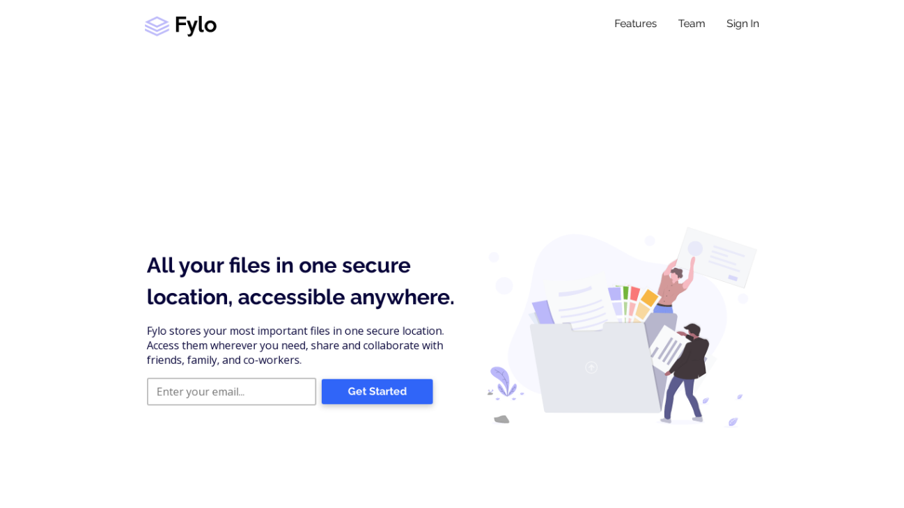

# Frontend Mentor - Fylo landing page with two column layout solution

This is a solution to the [Fylo landing page with two column layout challenge on Frontend Mentor](https://www.frontendmentor.io/challenges/fylo-landing-page-with-two-column-layout-5ca5ef041e82137ec91a50f5). Frontend Mentor challenges help you improve your coding skills by building realistic projects. 

## Table of contents

- [Overview](#overview)
  - [The challenge](#the-challenge)
  - [Screenshot](#screenshot)
  - [Links](#links)
- [My process](#my-process)
  - [Built with](#built-with)
  - [What I learned](#what-i-learned)
  - [Continued development](#continued-development)
- [Author](#author)

## Overview

### The challenge

Users should be able to:

- View the optimal layout for the site depending on their device's screen size
- See hover states for all interactive elements on the page

### Screenshot

### Links

- Solution URL: [https://github.com/davidudo/fylo-website-01](https://github.com/davidudo/fylo-website-01)
- Live Site URL: [https://davidudo.github.io/fylo-website-01](https://davidudo.github.io/fylo-website-01/)

## My process

### Built with

- Semantic HTML5 markup
- CSS custom properties
- Flexbox
- Mobile-first workflow

### What I learned

During this project I discovered a website I could use to check the responsiveness of my websites.

### Continued development

I look forward to building more complex CSS layouts, like a dashboard.

## Author

- Frontend Mentor - [@davidudo](https://www.frontendmentor.io/profile/davidudo)
- Twitter - [@davidudo](https://www.twitter.com/_davidudo)
